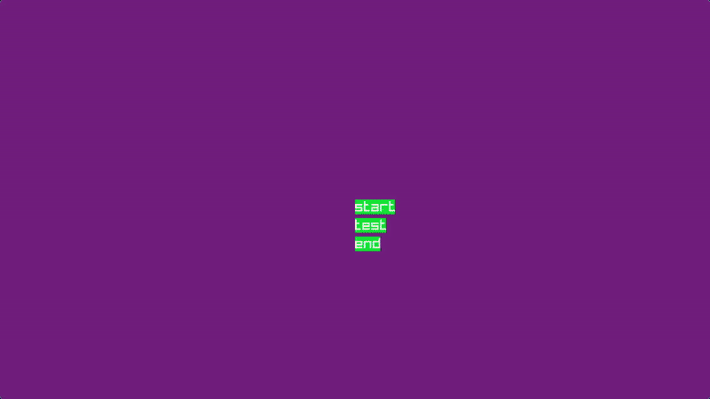

# This project aims to extend [cub3D](https://github.com/hieutrpham/wolf3d) with a gameplay loop using Raylib
* I've rewrote the cub3D project in Raylib and added a list of gameplay logic



## What I've added
* A simple menu screen
* A gameplay loop where enemies chase the player
* Enemies die when they collide each other
* Player wins when all enemies die
* An end game screen where player collides with enemies and dies

# Goals of the project
* Create a playable game using the rendering algorithm used in the famous Wolfenstein 3D
* Practice linear algebra especially vectors
* Tests whenever possible
* Learn game development and what goes into creating a game from scratch to finish (publishing)

# Build
```bash
$ make
$ ./main
```

## TODO:
 - [x] implement minimap. very scuffed version
    - [] stop showing minimap when dead
 - [x] start screen
 - [] continue screen to the next map
 - [] end screen to restart the game
 - [x] textures for enemy and friend
 - [] textures for floor, ceiling
 - [] animation
